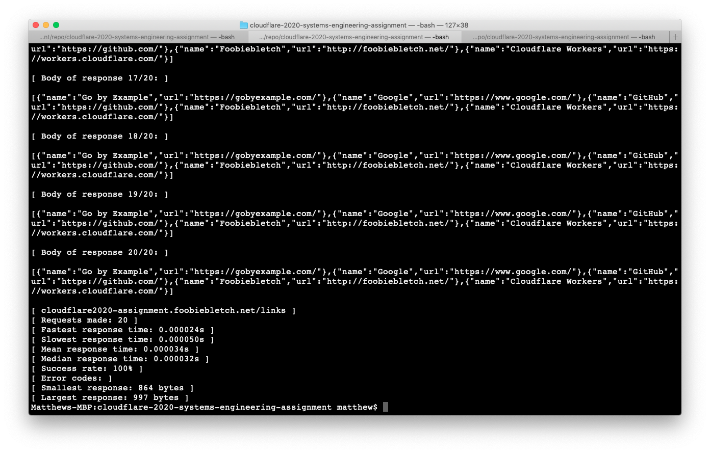
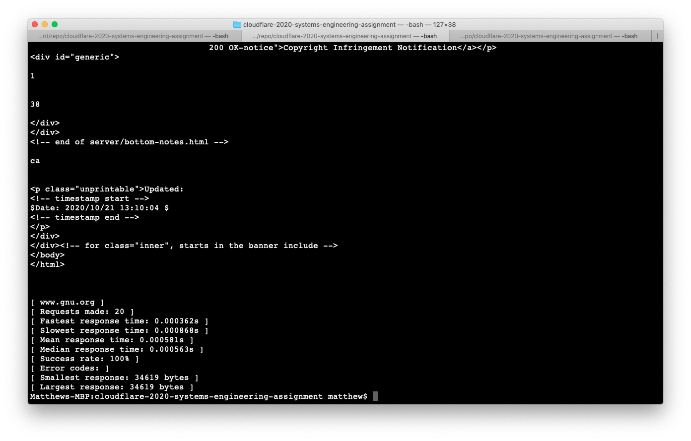

# makereq
Made for Cloudflare's 2020 Systems Engineering Assignment, makereq is a simple client socket that can make a specified number of requests to a host, display the responses and response metrics.

## Building
Run `make` to compile.

`make check` will send a request to the website I made for Cloudflare's 2020 General Engineering Assignment.

`make links` will request my website's links url.

`make profile` will request my website's links url 4 times.

## Usage
`makereq --url <url> [--profile <number of requests>]`

`makereq --url <url>` will send a request to `<url>`, display the response body and the following metrics :

- Number of requests
- Time of fastest and slowest response
- Mean and median response times
- Response success rate
- Error codes
- Byte size of largest and smallest responses

`makereq --url <url> --profile <number>` will do what `makereq --url <url>` does but `<number>` times.

`makereq --help` will display a simple help message.

## Example Screenshots

*makereq sending 20 requests to `cloudflare2020-assignment.foobiebletch.net/links`*


*makereq sending 20 requests to `www.gnu.org`*


## Testing Results
50 requests to my links:
```
[ cloudflare2020-assignment.foobiebletch.net/links ]
[ Requests made: 50 ]
[ Fastest response time: 0.000018s ]
[ Slowest response time: 0.000054s ]
[ Mean response time: 0.000034s ]
[ Median response time: 0.000035s ]
[ Success rate: 100% ]
[ Error codes: ]
[ Smallest response: 582 bytes ]
[ Largest response: 995 bytes ]
```

100 requests to my links:
```
[ cloudflare2020-assignment.foobiebletch.net/links ]
[ Requests made: 100 ]
[ Fastest response time: 0.000021s ]
[ Slowest response time: 0.000092s ]
[ Mean response time: 0.000038s ]
[ Median response time: 0.000038s ]
[ Success rate: 100% ]
[ Error codes: ]
[ Smallest response: 864 bytes ]
[ Largest response: 1005 bytes ]
```