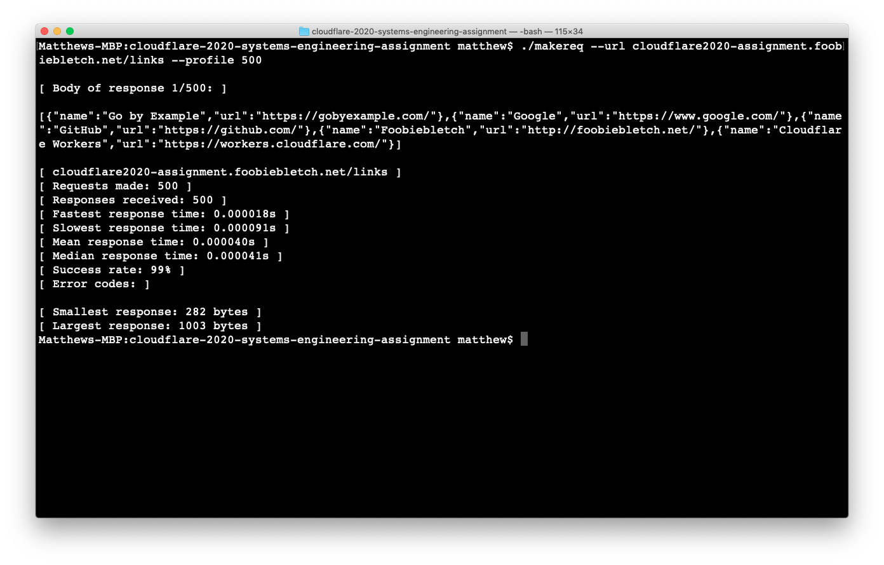
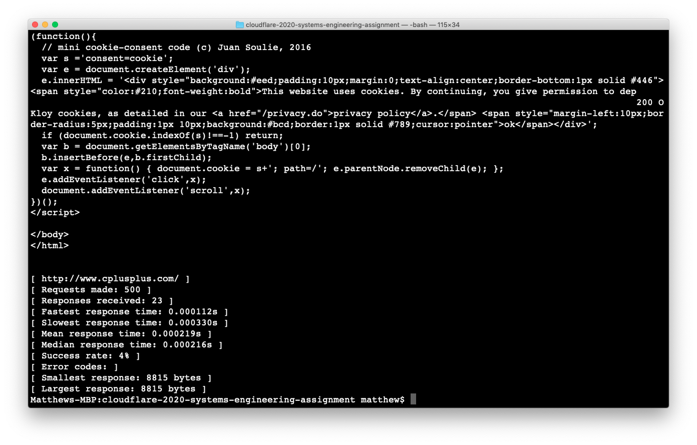

# makereq
Made for Cloudflare's 2020 Systems Engineering Assignment, makereq is a simple client socket that can make a specified number of requests to a host, display the responses and response metrics.

## Building
Run `make` to compile.

`make check` will send a request to the website I made for Cloudflare's 2020 General Engineering Assignment.

`make links` will request my website's links url.

`make profile` will request my website's links url 4 times.

## Usage
`makereq --url <url> [--profile <number of requests>]`

`makereq --url <url>` will send a request to `<url>`, display the response body and the following metrics :

- Number of requests made
- Number of responses received 
- Time of fastest and slowest response
- Mean and median response times
- Response success rate
- Error codes
- Byte size of largest and smallest responses

`makereq --url <url> --profile <number>` will do what `makereq --url <url>` does but `<number>` times.

`makereq --help` will display a simple help message.

## Example Screenshots

*makereq sending 500 requests to `cloudflare2020-assignment.foobiebletch.net/links`*


*makereq sending 500 requests to `cplusplus.com`*


## Testing Results
Below are blocks of output from making 500 requests to several websites that allow HTTP requests (including the one I made for the General Engineering Assignment).

cloudflare2020-assignment.foobiebletch.net/links
```
[ cloudflare2020-assignment.foobiebletch.net/links ]
[ Requests made: 500 ]
[ Responses received: 500 ]
[ Fastest response time: 0.000005s ]
[ Slowest response time: 0.000077s ]
[ Mean response time: 0.000029s ]
[ Median response time: 0.000025s ]
[ Success rate: 99% ]
[ Error codes: ]

[ Smallest response: 282 bytes ]
[ Largest response: 1024 bytes ]
```

www.cuny.edu
```
[ www.cuny.edu ]
[ Requests made: 500 ]
[ Responses received: 100 ]
[ Fastest response time: 0.001102s ]
[ Slowest response time: 0.003018s ]
[ Mean response time: 0.001536s ]
[ Median response time: 0.001486s ]
[ Success rate: 20% ]
[ Error codes: ]
[ Smallest response: 171837 bytes ]
[ Largest response: 171868 bytes ]
```

cplusplus.com
```
[ cplusplus.com ]
[ Requests made: 500 ]
[ Responses received: 101 ]
[ Fastest response time: 0.000092s ]
[ Slowest response time: 0.000243s ]
[ Mean response time: 0.000144s ]
[ Median response time: 0.000141s ]
[ Success rate: 20% ]
[ Error codes: ]
[ Smallest response: 8811 bytes ]
[ Largest response: 8830 bytes ]
```


www.google.com
```
[ www.google.com ]
[ Requests made: 500 ]
[ Responses received: 500 ]
[ Fastest response time: 0.000002s ]
[ Slowest response time: 0.000071s ]
[ Mean response time: 0.000012s ]
[ Median response time: 0.000009s ]
[ Success rate: 1% ]
[ Error codes: ]

[ Smallest response: 158 bytes ]
[ Largest response: 1024 bytes ]

```

duckduckgo.com
```
[ duckduckgo.com ]
[ Requests made: 500 ]
[ Responses received: 500 ]
[ Fastest response time: 0.000001s ]
[ Slowest response time: 0.000073s ]
[ Mean response time: 0.000010s ]
[ Median response time: 0.000006s ]
[ Success rate: 0% ]
[ Error codes: ]

[ Smallest response: 40 bytes ]
[ Largest response: 1024 bytes ]
```

All responses were received for each request except for cuny.edu, therefore I will exclude them from ranking.

Fastest response times for each set of responses, from fastest to slowest:
- duckduckgo.com : 1E-6s
- google.com : 2E-6s
- cloudflare2020-assignment.foobiebletch.net/links: 5E-6s

Mean response times from fastest to slowest:
- duckduckgo.com : 10E-6s
- google.com : 12E-6s
- cloudflare2020-assignment.foobiebletch.net/links: 29E-6s


## Issues
There are some big issues, and I'll confess to them here:
- Fixed-length responses aren't read correctly due to difficulties getting content-length from headers. This is a big deal but I'd prefer to submit this sooner than later. I believe chunked responses are handled correctly however, with the exception that chunk sizes have not been stripped from the response bodies (hex left in the text).
- This program will hang sometimes, usually when reading a large amount of chunked responses. I believe it is `read()` waiting for a response and therefore blocking the read of the program. I would like to solve this with an asynchronous timeout or some more pragmatic solution but again it's really time to submit.

Thank you for reading this and trying out my program.